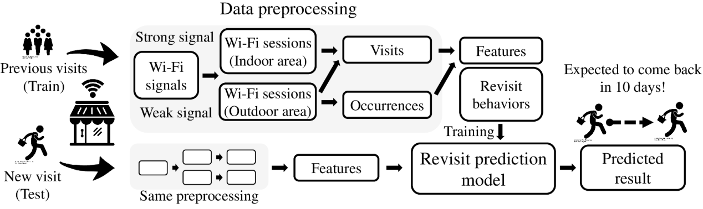

# Customer Revisit Prediction 
Our research about the customer revisit prediction.

> __Publication__ </br>
> Sundong Kim and Jae-Gil Lee., "Utilizing In-Store Sensors for Revisit Prediction," *In Proc. 2018 IEEE Int'l Conf. on Data Mining (ICDM)*, Singapore, Nov 2018. [[Paper]](./ICDM2018/2018_ICDM_Revisit.pdf) [[Poster]](./ICDM2018/2018_ICDM_Revisit_poster.pdf) 

## 1. Overview
Predicting revisit intention is very important for the retail industry. Converting first-time visitors to repeating customers is of prime importance for high profitability. However, revisit analyses for offline retail businesses have been conducted on a small scale in previous studies, mainly because their methodologies have mostly relied on manually collected data. With the help of noninvasive monitoring, analyzing a customer's behavior inside stores has become possible, and revisit statistics are available from the large portion of customers who turn on their Wi-Fi or Bluetooth devices. Using Wi-Fi fingerprinting data from ZOYI, we propose a systematic framework to predict the revisit intention of customers using only signals received from their mobile devices. Using data collected from seven flagship stores in downtown Seoul, we achieved 67-80\% prediction accuracy for all customers and 64-72\% prediction accuracy for first-time visitors. The performance improvement by considering customer mobility was 4.7-24.3\%. Our framework showed a feasibility to predict revisits using customer mobility from Wi-Fi signals, that have not been considered in previous marketing studies. Toward this goal, we examine the effect of data collection period on the prediction performance and present the robustness of our model on missing customers. Finally, we discuss the difficulties of securing prediction accuracy among features that look promising but disappointed.

## 2. Formulating a revisit prediction task
### Revisit prediction

>  Given a set of visits with known revisit intentions and revisit intervals, build a classifier that predicts unknown revisit intention and revisit interval for a new visit.

### Step-by-step preparation

* **Collecting Wi-Fi Signals**:  For each store, we collected customer's Wi-Fi signals. It has four attributes: UID, Sensor, RSSI and Timestamp. An example of five Wi-Fi signals is as follows:

  | UID  | Sensor | RSSI | Timestamp         |
  | ---- | ------ | ---- | ----------------- |
  | u1   | S7     | -45  | 17-10-01 14:25:32 |
  | u1   | S7     | -49  | 17-10-01 14:25:48 |
  | u1   | S5     | -41  | 17-10-01 14:26:12 |
  | u1   | S7     | -71  | 17-10-01 14:26:17 |
  | u1   | S1     | -42  | 17-10-01 14:26:32 |

* **Signal to session conversion**: Raw signals can be preprocessed into sessions. A session has four attributes: UID, Area, Dwell time and Timestamp. This data can be a basic block to construct customer's visits. In this example, the first two sessions are generated from the above five signals. Here, sensor names are directly used as the area name. However, various semantic areas can be used depending on the available information.

  | UID  | Area | Dwell time (sec) | Timestamp         |
  | ---- | ---- | ---------------- | ----------------- |
  | u1   | S7   | 40               | 17-10-01 14:25:32 |
  | u1   | S5   | 20               | 17-10-01 14:25:48 |
  | u1   | S7   | 135              | 17-10-09 17:42:16 |
  | u1   | S4   | 5                | 17-10-09 17:44:31 |
  | u1   | S1   | 20               | 17-10-19 17:44:36 |

* **Grouping sessions into a trajectory**: A set of sessions form a trajectory if the sessions are generated from the same visit.  The first two sessions from UID u1 form a trajectory t1 with S7→S5, and the last three sessions form a next trajectory t2 with S7→S4→S1.

* **Generating labels**: Using trajectories, we can define two revisit labels - RV_days and RV_bin. RV_days describes the revisit interval between the current visit and the next visit. RV_bin is the binary transformation of RV_days. To make a label for a past visit, information of next visit is required. Depending on your purpose, you can give a variation to these labels by setting the threshold of customer revisit (e.g., 180-days). Below tables illustrates revisit labels with customer trajectories. In this example, we consider a threshold of 180-days.

  | TID  | UID  | Trajectory        | Visit date | RV_days  | RV_bin  |
  | ---- | ---- | :---------------- | ---------- | -------- | ------- |
  | t1   | u1   | S7→S5             | 17-10-01   | 8 days   | True    |
  | t2   | u1   | S7→S4→S1          | 17-10-09   | 148 days | True    |
  | t3   | u1   | S7→S1→S2→ ... →S5 | 18-03-05   | Inf      | Unknown |
  | t4   | u2   | S7→S5             | 17-10-02   | 419 days | False   |
  | t5   | u2   | S7                | 18-11-24   | Inf      | Unknown |

* **Predictive Analytics**: By separating data into a train and a test set, we finally set up our revisit prediction task.
  

## 3. Dataset
We are negotiating to release benchmark in-store mobility datasets for revisit prediction.
After we get the permission, we will upload the prepared datasets. Stay tuned.

### Sample datasets
Sample datasets of two stores can be found in [data_sample/indoor](./data_sample/indoor) directory.
Each sample dataset includes randomly selected 500 users from theãunpublished benchmark dataset of each store.
A time span of the benchmark dataset is one year, from Jan 1, 2017, to Dec 31, 2017. 
We devide the first 6 months of data as a train set and the rest as a test set.
Some customers(wifi_id) of the test set do not exist in the training set. 
In the train set, each wifi_id can have multiple visits if the customer is a frequent visitor. 
However, in the test set, we only retain the first visit for each customer during the time period.

Datasets for each store consists of train/test_labels, train/test_visits, and corresponding Wi-Fi sessions data.

Attributes of each dataset are as follows:
* train/test_labels.tsv: visit_id, revisit_interval(days), revisit_intention(binary)
* train/test_visits.tsv: visit_id, wifi_id, date, indices(=trajectory) 
* wifi_sessions.tsv: index, wifi_id, ts, area, dwell_time(seconds)


<!---
| Name                  | Store A  | Store B  |
| --------------------- | -------- | -------- |
| Collection length     | 360 days | 360 days |
| \# of sensors         | 14       | 11       |
| \# of unique visitors | 1,000    | 1,000    |
| Avg revisit rate      | 21.22%   | 32.98%   |

## 4. How to run

* Compile

  * Check parameters

    ```
        -i : the hdfs file/dir path for input data set.
        -o : the local file path to write the meta result of clustering (e.g., # of (sub-)cells, # of points for each cluster).
        -np : the total number of cpu cores or partitions which you want to set.
        -rho : the approximation parameter
        -dim : the number of dimensions.
        -minPts : the minimum number of neighbor points.
        -eps : the radius of a neighborhood.
    ```

* Preprocess

## 5. Tutorial

* We will upload some tutorials in \notebooks directory. 

  --->

## Reference 

If you find this page useful, please consider citing our work.

```
@inproceedings{kim2018icdm,
  author    = {Sundong Kim and Jae-Gil Lee},
  title     = {Utilizing In-Store Sensors for Revisit Prediction},
  booktitle = {Proceedings of the IEEE International Conference on Data Mining},
  year      = {2018},
}
```
